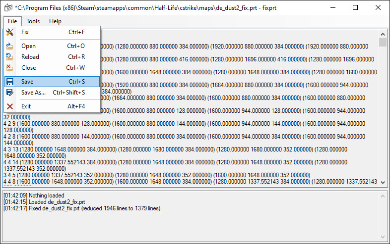
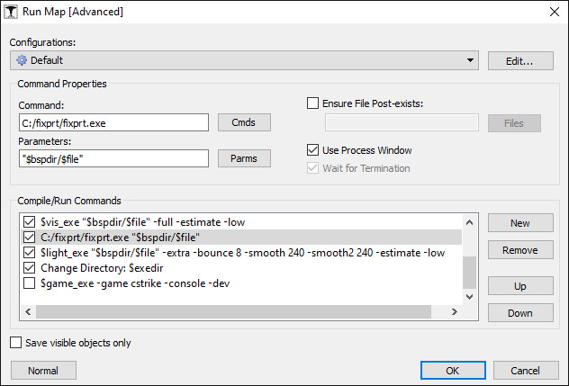
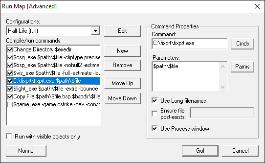
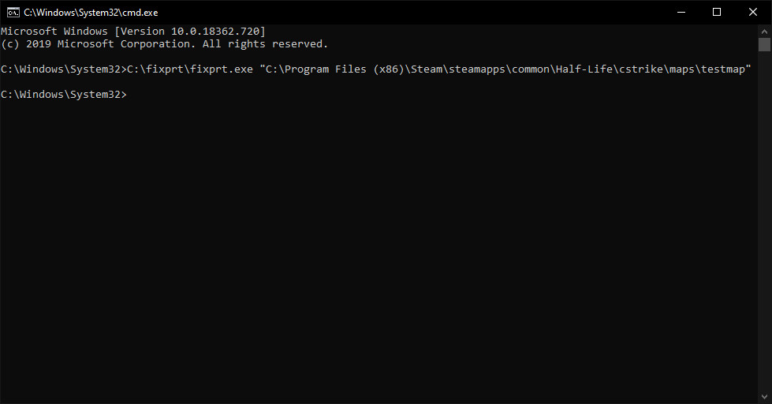

> **Note:** This project is archived

# fixprt
This tool reformats Half-Life portal files so they can be imported to J.A.C.K. You can automatically fix them as you compile by integrating this tool into the compile/run commands. The tool's functionality is default in <a href="https://gamebanana.com/tools/6778">SDHLT</a>

## Links
- [SDHLT](https://github.com/seedee/SDHLT)
